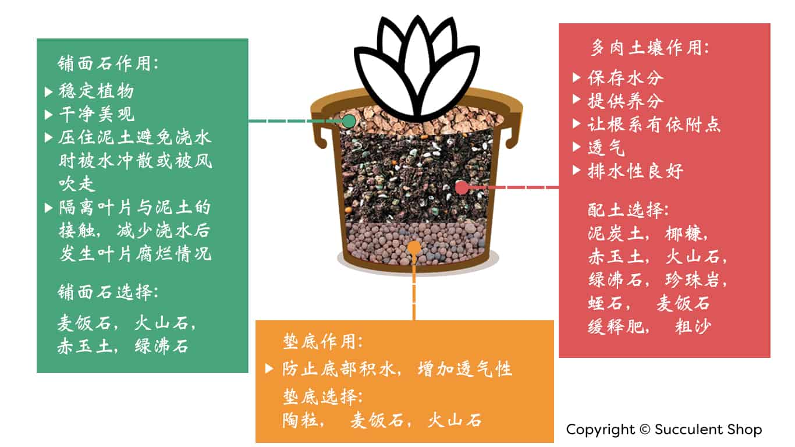

[TOC]

# 养殖

- 水

- 土

- 肥
- 光
- 修剪

## 盆

## 水

### 频率

### 酸碱性

### 多肉浇水

[上盆、浇水加养护，新购多肉植物回家后该办的事（详解）_网易订阅](https://www.163.com/dy/article/DFE5P9BG0525V885.html)

- **换土换盆：**多肉自带的土壤全部扔掉，最好自己换土换盆
- **修根**：将原来的老根全部去掉。老根的呼吸及吸收功能都非常差，并且容易使土壤结成块状，不利于生长。如果多肉几个月不生长或者状态一直不好，多半就是根系出了毛病，这时要重新翻盆检查。不论是新购入还是重新翻盆时，都一定要先把**须根(特别细的根)和死根(黑色的根)揪掉**(推荐用手揪，不要用剪刀剪)，不好的根轻轻一揪就掉，留下健康的根，不用担心这样做会损伤根系，相对于多肉植物本身来说，根系生长的速度快多了，只需一周时间就可以生出健康的根系。
- **修根总结**：粗壮健康的主根可以留下，那些非常细而且密密麻麻的毛细根基本可以剪掉，因为快递过程中，这些毛细根大部分都坏死了，留着不但累赘而且可能妨碍到新根的长出，健康的多肉植株，即便根系全部修剪过了，过段时间很快也会长出。但是修根的话就需要给根系的伤口消毒杀菌下，可以选择多菌灵类的杀菌药剂，洗完之后在通风处晾个一晚上或者一天再种下，若是伤口比较大的必须晾到伤口干燥回缩后才行不要太担心放太久种植存活的问题，想想那些海淘族，路上搁置的时间更长。
- **修叶：**根修剪好之后，要对多肉下部枯死老化的叶片进行清理，摘除枯死的老叶片，并观察是否有病虫害，要摘除有病害的叶片，避免进一步感染。多肉植物在生长过程中会消耗最底部的叶片，叶片慢慢干枯并且堆积起来，越来越多。购入或者翻盆时要将这些叶片清理掉，干枯的叶片很容易引发霉菌，霉菌是多肉的终极杀手之一。大部分多肉就是因为通风不畅滋生了这些霉菌，爆发起来再挽救已经晚了。另外，枯叶也是虫子产卵的理想温室，大部分虫卵都是出现在枯叶里的。
- **防虫：**新购入的多肉一定要做好防虫措施，我就遇到过无数次虫子入侵的情况，大部分都是购入时预防措施没做或者清理不彻底造成的。多肉植物患虫的几率比其他植物小很多，只要管理得当，基本不会出现虫子。经过翻盆折腾和修根后，多肉抵抗力会稍微减弱，所以尽量不要用药，比较好的方法就是用水清洗，如果虫子较多就用清水浸泡10分钟，然后再清洗一下就可以了。
- **晾干：**清洗消毒后的多肉一定要彻底晾干后再种，注意哦，说的是“晾干”不是“晒干”哦。虽然不用晾干直接种上也能够生根生长，但是后期比较容易生病。彻底晾干后再栽种的多肉，在后期生长中健康度明显高于未晾干直接栽种的。晾干时间在1-2天，晾干时要避免阳光直射，需放在通风良好、干燥的地方，伤口愈合后潮土或干土上盆。
- **上盆：**晾干后的多肉植物，可进行上盆种植。种植用土要求疏松透气，颗粒物多，最好是事先暴晒杀菌处理过的。建议花盆底部先铺一层大颗粒的植料，上层小颗粒，植料的大小从下往上逐渐减小，以利于排水。种植时动作应尽量轻柔些，避免再次伤害根系，用土把根本盖住，用手轻轻压实土面。然后在土面喷水薄薄的一层杀菌剂溶液，**让土壤微微泛潮**即可，有一点点湿度，有利于新根的萌发。注意这个是“**潮土干栽**”的方法。也可以用“**湿土干栽**”的方法。
- **湿土干栽**：就是先把土加水拌的微微湿润，然后再把多肉植物栽进去的方法，这两种方法都可以，但是要注意水一定不要多。千万注意的是：**刚种上的多肉一定一定不要去浇水！不要浇水！不要浇水！**重要的事情说三遍。
- **潮土干栽**：潮土就是把混好的土倒上一些水搅拌，湿度为手捏成一团松开则散为最好，可以想象下拧干毛巾的湿度，大概就是那种感觉。建议把混好的土倒上一些水搅拌，这样的湿度会均匀点。
- **新肉浇水：**许多人认为新购入的多肉种好后第一周是不需要浇水的，这其实并不准确，要**看土壤的干湿情况而定**。如果是潮土(土壤中含有一定水分)，种好后的确可以5天甚至一周都不用浇水。但土壤过分干燥是不利于生根的，根系无法从中吸收水分，也很难生出新根，即使生出新的根系也会枯死。所以，采用**喷水或者少量浇水的方式让根系附近的土壤具有一定水分，才便于生根**。
- **缓苗：**上盆后还是放在**阴凉通风处**，**没有阳光直射**的地方进行养护，待**服盆后再浇水**，等到最底部叶子变得硬实了，说明根系已经长好，可以逐渐晒太阳了，这期间底部可能会有一两片叶子枯萎，属正常现象。如果只是逐渐的干化，可以不去理会，这是消耗叶片的营养给母体。如果是有水化黑化的趋势就要尽早剔除，同时要考虑下自己的配土是不是太湿了，或者通风并不怎么好，水太湿了，就控制浇水甚至可以拔出来再重新种下，通风不良就换个好点的通风环境。一些快递过程中出现的干枯发黑的叶子，应该拔掉，因为枯叶如果不剔除上盆后很容易与土壤接触，在湿度较高的情况下极容易腐败霉变，如果之前还不小心弄伤了植株的话，烂芯化水什么的就很正常了，对于一些叶片排列较为紧密，或者植株较小的，可以考虑用镊子干活，非常方便！！至于健康叶片附近的这些未完全代谢完毕的叶子，试着轻轻夹，夹不掉可以暂不去除，上盆后待其自然干枯后拿掉就可以了……缓苗发根期间枯掉一圈叶子是很正常的，是植物正常的新陈代谢。多肉缓苗的**大原则就是潮土干栽，在通风明亮处（无直射光）养护。最大的忌讳是闷热潮湿，强烈的直射光。**
- **浇水：**植物根系还没缓好的时候，浇水越多并不代表多肉可以吸收的水分越多，反而是给闷热潮湿提供有利环境…大多数多肉植物缓苗的时候死掉往往不是干死的而是烂死的。可以**在土表显干的时候，再耐心等个一两天在少量浇点水**，如果实在没有把握，可以在同样大小的盆子里放等量的土，根据该盆土的干度，决定浇水不浇水（因为刚开始缓苗的时候多肉基本不吸取水分，两者消耗的水分是一致的）。
- 土：直接买配好的土或者自己配土，泥炭(40%)：稻壳碳(10%)：3-6mm颗粒土(50%，比如鹿沼土)，大概按照这个比例，如果环境通风好，盆又小又透气，可以少放点儿颗粒土，反之，颗粒土就多些。
- 盆：盆一定要买有底孔的，红陶盆太透气，对于环境通风不好又手欠爱浇水的人来说是个不错的选择，不过还是建议**选7cm以上的**，因为盆太小了土容易干，养出的肉肉不肥。不过红陶盆养肉比较容易出状态。
- 塑料盆和陶瓷盆透气性不好，**建议选广口的**，一定不要选细脖子那种，不透气。控根盆、泥盆透气性介于以上两种之间，都是不错的选择。深色盆吸光，如果用深色的塑料盆，冬天用对肉肉有好处。但是夏天一定要做好遮阳工作，只遮肉肉是不行的，盆也一定不能晒!
- 如果肉肉长大了，**把盆口堵住了，就需要换盆**，否则浇水不好浇，而且会严重影响透气。
- 浇水：多肉植物缺水干巴死是很难的，所以不知道该不该浇的时候，就不浇，春秋两季土干了就浇，而且要浇透，可以**每隔三四周让土干透一下**，避免长期潮湿导致烂根啥的。浇水方式也没什么讲究，浇在肉肉上啦，浸盆啦，都没关系。春秋是肉肉生长的季节，想让肉肉长得肥就浇得稍微勤点儿。注意是稍微啊!稍微!再勤也**得等土干得差不多了再浇**。想让肉肉出状态、颜色好看就不要浇太勤，如果肉肉徒了(就是长高了)或者**叶子朝下长，说明水浇多了、缺少光照，需要控水**(就是少浇水，注意不是不浇啊)并加强光照。
- **浇水之夏天**：选择接下来几天天气晴朗稍微凉爽有风的傍晚，**沿盆边稍微给一圈儿水**。最好是等到第二天最热的时候，水已经没有了。因为夏天温度高，如果盆土高湿，就相当于蒸笼啊!后果请自行想象。
- 注意**水不要浇到叶子上，更不要使叶心和叶片之间积水**。如果不小心浇到了，一定要把水珠吹出去。叶片上有水珠，相当于放大镜，太阳一照会灼伤叶片。叶片间积水后果更严重，只要第二天太阳一照，这颗肉基本就完蛋了。
- **浇水之冬天**：选**中午浇**呗~ 也是**沿盆边稍微给一圈儿水**。晚上最冷的时候盆里就不要有水了。大冷天儿，湿乎乎的更冷，对不?
- 夏转秋，冬转春的时候，浇水量要逐渐加多，最好不要一下子突然给大水。虽然普货皮实，突然给大水一般也不会挂，但还是建议**让肉肉有一个适应的过程**。
- **通风：**不管哪个季节，都一定要注意通风。尤其是盆里有水分的时候，一定要通风!!!透露一下，给肉肉吹风扇的人不在少数。

[多肉第一次上盆别马虎，按照这7步来，多肉易活状态佳！ - 知乎](https://zhuanlan.zhihu.com/p/54035376)

## 土

[养花知识花卉用什么土？](https://k.sina.com.cn/article_5589443288_14d2822d800100xjqk.html?from=home)

### **全能型**

#### 赤玉土

- 综合指标好，固根能力好，吸水性强，少量养分，1-2 年内透气性不错，弱酸性。不需要搭配其他植料
- 较贵、时间久了板结，损耗，2年内要翻盘不然透气性随粉化程度急剧下降

#### 鹿沼土

类似赤玉土，但是硬度低，粉化快，可以不用来种植，用来铺面

#### 颗粒泥炭

黑色小球状植料。活性炭？

比泥炭有营养，硬度高，透气，可重复利用

固根能力差

#### 煤渣

便宜，上家不卖，据说好用

#### 水苔

干净而且可塑性好

水苔比较贵

### 保水透气植料

#### 珍珠岩（反面教材）

像泡沫塑料，风吹就跑，易粉化，透气不好，无营养

便宜，白色好看

成品培土含这个的，比较坑

#### 火山岩

#### 颗粒土

#### 蛭石

保水性好，有透气性

易碎，但不会成粉末

固根能力还不错，根钻进去就碎

用来调节湿度

金灿灿的，好看

#### 小颗粒轻石

- 质地坚硬，不粉化，吸水透气，含极少养分
- 吸水不如蛭石，但是调节颗粒土的透气性较好

可单独使用？

#### 粗沙

- 不含养分，固根也不行，也不吸水
- 粗沙不会板结，透气，比较重，可以调整土壤的比重
- 其它植料比较轻，种高大的植物，加粗沙有必要

#### 河滩沙土

#### 钵底石(大颗粒轻石)

太大，只能用来垫底

像假山，可以装饰花盆

#### 陶粒（排水层首选）

- 类似砖头的工艺，固根性不好，即使小颗粒的陶粒，也很少大量加入培土
- 可以替代钵底石当排水层介质

### 添加营养

#### 泥炭类植料

- 保水固根能力好，便宜，看起来像传统土壤
- 营养含量不高，泥炭不适合新手，含水饱和后透气性差，可以过筛子，增加透气性
- 粗纤维的泥炭土透气性好，细纤维的不行

#### 椰糠

- 性价比高于粗纤维泥炭
- 换盆脱土方便，可以重复利用。干净，有营养

#### 花生壳

比泥炭、椰糠营养丰富，腐化后就是钾肥，颗粒化程度高，固根吸水能力好

和轻石搭调

#### 稻壳炭

类似花生壳，富含钾肥，但是碱性强

### 多肉配土建议

[多肉配土/生长阶段等](https://k.sina.com.cn/article_6334510976_17990f78000100kgnm.html?from=home)

- 可以单独使用植料
- 配土时，上述每类选一种就好，配比随意，根据需求来
  - 育苗：小颗粒加保水
  - 老桩要排水好，贫瘠也不要紧
- 配土是调整出来，如果盆土干的快，就多加蛭石；排水慢加轻石。合适的就是好的。

- 多肉配土基本公式:[泥炭土](https://www.zhihu.com/search?q=泥炭土&search_source=Entity&hybrid_search_source=Entity&hybrid_search_extra={"sourceType"%3A"answer"%2C"sourceId"%3A1850184862})+颗粒土+底肥+消毒杀虫颗粒，总体要求营养搭配，疏松透气，杀菌除虫。

- 阳台党，颗粒比例也要大，盆子要浅，最好是泥瓦盆或者陶盆，注意通风
- 多肉可以用“骨粉”做养料
- 多肉分3阶段配土
  - 初期育苗阶段：五分之一的颗粒土养初期的多肉是正合适的，搭配比例：（营养土7：2蛭石：0.5骨粉）多肉上盆后，可以在花盆的表面加上一层赤玉土的铺面石。
  - 中期生长阶段：颗粒土的含量要达到30%，长势比较快，土壤要足够的疏松透气，同时土壤的保水还要好，在营养土的基础上，可以加入别的介质，像椰砖。
  - 后期老桩阶段：栽种的土壤颗粒含量最好是能达到一半以上，颗粒土的含量越多，越适合老桩的生长，栽种的老桩用大盆。小盆的生长空间有限，不适合种老桩，有条件的用“陶土”盆最好，关键是花盆的高度。

[多肉土壤，铺面和垫底石用途](https://succulent.my/2020/12/10/%E5%A4%9A%E8%82%89%E5%9C%9F%E5%A3%A4%EF%BC%8C%E9%93%BA%E9%9D%A2%E5%92%8C%E5%9E%AB%E5%BA%95%E7%9F%B3%E7%94%A8%E9%80%94/)

- 铺面石的作用。第一：美观好看，整洁。第二：压住土壤，避免风大时吹走泥土，也避免在我们浇水的时候打散土壤随着水流出来，弄脏周围。第三：抬高叶片与泥土的接触，减少浇水后叶片腐烂情况发生。第四：稳住多肉，避免风大吹走。
- 铺面石的选择有很多种类，例如：火山石，麦饭石，绿沸石，赤玉土等
- 不同颜色的多肉和花盆可以搭配不同的铺面石来突出多肉的颜色和形态。比如浅色的多肉我们可以用赤玉土，火山石来搭配，颜色鲜艳的多肉，可以用绿沸石，麦饭石来搭配。
- 不建议用白石子来铺面，白石子透气度不好，吸热性太强会闷到多肉。珍珠岩和蛭石都不适合铺面用，它们都太轻了风一吹就散了
- 垫底的作用是防止底部积水，增加透气性。陶粒是垫底的最好选择，方便买到价格也便宜。大颗粒的轻石也是垫底的不错选择。
- 

铺面用啥？

垫底用啥？

种植用啥？

每种植物用啥？取交集

每种植物的花盆设计，铺面、垫底、植料

排水层？

#### 栀子花配土

- 肥厚、透气、保湿、微酸

- 几种配土的方法。

  ①将沙壤土和泥炭土按一比一的比例混匀。前者的保湿能力非常强，而后者不但透气，并且含有大量的养分，可以满足花儿的成长所需。

  ②将腐叶土、沙壤土及河沙按二比二比一的比例混匀。这种方法混合配成的土不但养分含量高，透气保湿能力强，而且呈弱酸性，非常适合这种花儿的生长。

  ③将园土和河沙按三比二的比例混匀。这种方法制成的花土效果比起前两种要稍差一些，不过还是可以使用的。

  往土里加松针，刚捡回来的松针不能直接使用，这是因为，刚掉落的松针表面带有松油，直接使用，松油会在土中分解发霉，并释放热量，容易烧根。我们需要将松针暴晒半年后再使用，去除松油之后，就不用担心烧根这个问题啦。

  配土的时候还需要加入一些粗河沙或是小颗粒，红土、松针、粗河沙3：1:1的

- 定时给栀子花使用花懂得酸性植物专用的有机营养液，保持土壤肥力，每隔两周，将营养液兑水800倍稀释。施用完肥液以后，第二天早晨要再浇一次清水，是肥液能够顺水渗透到土壤深处，使土壤整体肥力都很充足。

6：3:1的沙子，园土，椰糠土

栀子花：松针土、酸性土，蛭石铺面，营养土、河沙

火山岩、麦饭石

粗砂、椰糠

营养土

陶粒

煤渣偏碱

### 绿萝配土

- 不可以光用园土，或是光用椰砖，绿萝喜欢含有腐殖质丰富，肥沃疏松，偏酸性的土壤
- 腐叶土加入一些泥炭土，腐叶土最重要

# 种类

- 喜阴

- 喜阳

- 喜酸

- 喜碱

- 花

- 草

## 金钻

- 金钻有哪些品种
- 金钻和绿萝区别
- 大叶金钻和小叶金钻区别？小叶深绿色的是啥？
  - 长得小的好像就是小叶金钻
- 绿公主和绿萝区别

- 深根浅根？
  - [室内养殖“金钻花”，这几个条件做好，叶子大又绿，长势旺盛 - 知乎](https://zhuanlan.zhihu.com/p/393717400)
  - 千万不要用深盆，用矮一点的花盆，因为它全是粗根，没有毛细根，如果盆大土壤多，或者是花盆太深的话，容易导致烂根，烂根以后就会出现烂叶等的情况。土壤尽可能选择透气性好一些的，建议大家用点购买到的现成的营养土，或者是用腐叶土加煤渣之类的调配，尽可能颗粒多一点，这样透气性好养它就不容易出问题。

橡皮树和金钻的区别?

为什么我买的金钻叶子很大，公司的叶子很小？只是因为大小的区别吗？

红枫、小叶紫檀、金丝楠木、蓬莱松

- 金丝楠木的用途决定了不适合在家里养
- 松柏也不适合家养，柳、槐、桑、梨

四大名木：

- 金丝楠木、小叶紫檀、沉香、黄花梨

# 参考

[绿萝养护](http://www.100loutong.com/news/show-2191.html)

[办公室绿植](https://zhuanlan.zhihu.com/p/35528736)

[办公室绿植](https://www.zhihu.com/question/29181149)

[适合办公室的绿植有哪些？办公室养什么植物运气好？](http://henan.china.com.cn/tech/2020-06/24/content_41198112.htm)

[10种适合室内养的植物](http://ccylj.changchun.gov.cn/ylkpej/ylkp/202103/t20210310_2768876.html)

# 居家养护

## 栀子花

- 

栀子花、绿萝、富贵竹、常青藤、清香木、瑞香、蝴蝶兰、黄金万年草、浆果、静夜、吉娃娃、芦荟（波露、女王、十二卷）、金钱木、万重山、金钻

蓝莲花、橡皮树、红枫、小叶紫檀、彭珊珊、豆瓣绿、无敌贝贝、无敌贝拉安娜

花叶七宝树

盘叶莲花掌

熊童子

红稚儿

紫珍珠

花月夜

白牡丹

玉吊钟

月兔耳

绫锦

千代田锦

小红衣、三角琉璃莲

紫牡丹

白雪姬

赤鬼城、观音莲

蝉翼玉露

绯牡丹

紫蛮刀

虎刺梅

玉扇
